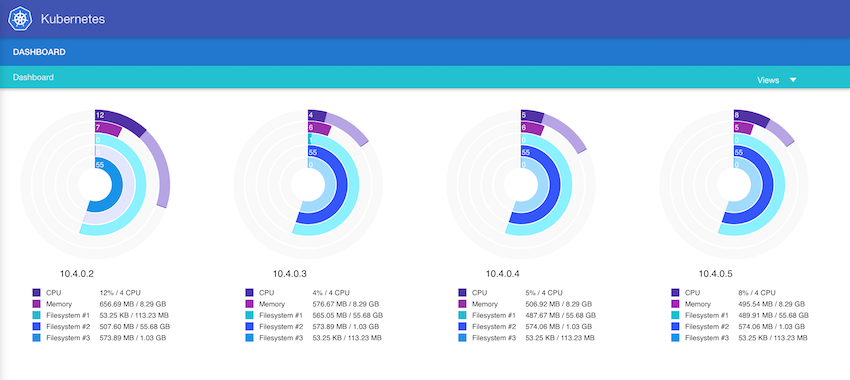

# kubernetes-cluster-intel-nuc
Kubernetes cluster running on Intel NUC

Based on https://github.com/coreos/coreos-kubernetes

## Create configuration:

customize network parameters and cluster size in `build-user-data.sh`
```
./build-user-data.sh
```

## CoreOS installation

To keep the installation process simple we use the provided iso file to create

mount usb drive:

```
mount /dev/sdb1 /mnt
```

install CoreOS
```
wget https://raw.githubusercontent.com/coreos/init/master/bin/coreos-install
chmod +x coreos-install
sudo ./coreos-install -d /dev/sda -v 899.1.0 -c /mnt/user-data-<node ip>
```

Reboot

## Configure kubectl

```
kubectl config set-cluster nuc --server=https://10.4.0.2:443 --certificate-authority=${PWD}/ssl/ca.pem
kubectl config set-credentials nuc-admin --certificate-authority=${PWD}/ssl/ca.pem --client-key=${PWD}/ssl/admin-key.pem --client-certificate=${PWD}/ssl/admin.pem
kubectl config set-context nuc --cluster=nuc --user=nuc-admin
kubectl config use-context nuc
```

```
$ kubectl get nodes
NAME       LABELS                            STATUS    AGE
10.4.0.2   kubernetes.io/hostname=10.4.0.2   Ready     3d
10.4.0.3   kubernetes.io/hostname=10.4.0.3   Ready     3d
10.4.0.4   kubernetes.io/hostname=10.4.0.4   Ready     1h
10.4.0.5   kubernetes.io/hostname=10.4.0.5   Ready     1h
```

## Client certificate installation

To access the apiserver url (https://10.4.0.2) we need a client certificate. Without one we see this:
```
$ curl https://10.4.0.2/ -v
*   Trying 10.4.0.2...
* Connected to 10.4.0.2 (10.4.0.2) port 443 (#0)
* WARNING: using IP address, SNI is being disabled by the OS.
* TLS 1.2 connection using TLS_ECDHE_RSA_WITH_AES_128_GCM_SHA256
* Server certificate: kube-controller
* Server certificate: kube-ca
> GET / HTTP/1.1
> Host: 10.4.0.2
> User-Agent: curl/7.43.0
> Accept: */*
>
< HTTP/1.1 401 Unauthorized
< Content-Type: text/plain; charset=utf-8
< Date: Sun, 20 Dec 2015 22:42:52 GMT
< Content-Length: 13
<
Unauthorized
* Connection #0 to host 10.4.0.2 left intact
```

```
curl https://10.4.0.2/  -E ssl/worker.p12:<your password> --cacert ssl/ca.pem
{
  "paths": [
    "/api",
    "/api/v1",
    "/apis",
    "/apis/extensions",
    "/apis/extensions/v1beta1",
    "/healthz",
    "/healthz/ping",
    "/logs/",
    "/metrics",
    "/resetMetrics",
    "/swagger-ui/",
    "/swaggerapi/",
    "/ui/",
    "/version"
  ]
}
```

To fix this issue we need to install the generated certificate `worker.p12` and `ca.pem` located in the ssl directory.

## Addon installation:
```
kubectl create -f manifests/kube-dns-rc.yaml
kubectl create -f manifests/kube-dns-svc.yaml
kubectl create -f manifests/kube-ui-rc.yaml
kubectl create -f manifests/kube-ui-svc.yaml
```

Now we can access `kube-ui` located in `https://10.4.0.2/api/v1/proxy/namespaces/kube-system/services/kube-ui/#/dashboard/`


